# PandemicAI — Interface Guide

> This document describes the UI concepts and on-screen elements of the two-player, multitouch-table interface. It uses screenshots taken from the game to illustrate each component and state.

---

## Contents
- [0) Return to Main Document](../pandemic_multitouch_doc.md)
- [1) Layout at a Glance](#1-layout-at-a-glance)
- [2) Player Areas (Left & Right)](#2-player-areas-left--right)
- [3) Action Buttons & States](#3-action-buttons--states)
- [4) Shared Board Elements](#4-shared-board-elements)
- [5) Game Events](#5-game-events)
- [6) Win Loss Conditions](#6-win--loss-conditions)
- [7) Design Considerations](#7-design-considerations)

---

## 1) Layout at a Glance
- **Full Board** - The interface is divided into three main sections: two Player Areas on the left and right sides of the screen, and a central Shared Board. This symmetrical design allows two players sitting opposite each other to comfortably interact with the game.
 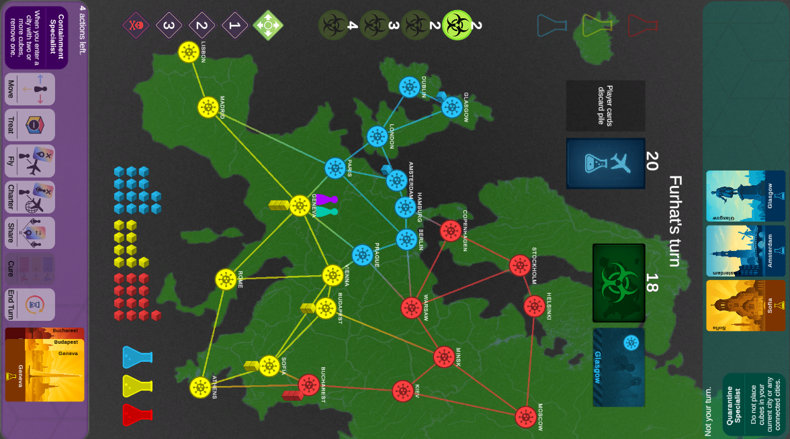

- **Left Player Area** — controls for Player A: role, ability, action buttons, and collapsed hand (to give space for all interface elements).  
  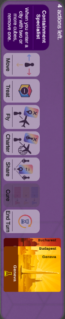

- **Right Player Area** — controls for Player B (mirrored for table play). Non-active player’s hand stays **expanded** by default.  
  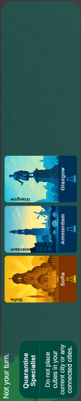

- **Shared Board** — central map with pawns showing current players' locations, disease cubes on cities, reserve cubes, outbreak and infection trackers, cure tracker, and decks/discards.  
  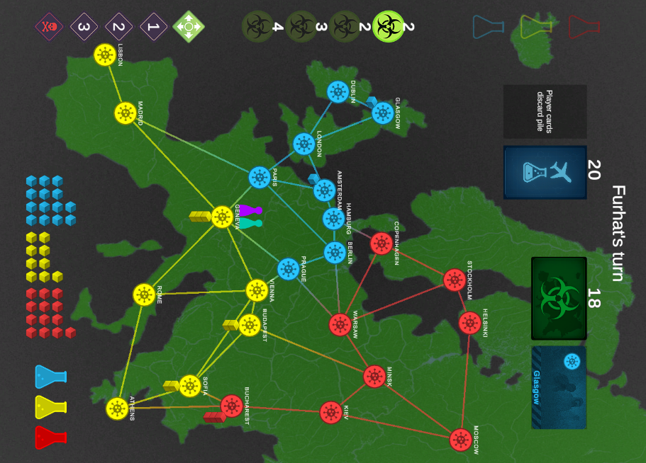

---

## 2) Player Areas (Left & Right)
Designed for a **multitouch table** so each player has a comfortable, orientation-correct control panel next to them. The functionality of this area changes depending on whether it is their turn or not.

Each player panel shows:
- **Role card & role ability** (left): concise summary of the unique power attributed to each player.
- **Action buttons**: `Move`, `Treat`, `Fly`, `Charter`, `Share`, `Cure`, `End Turn`.
- **Hand of city cards**: collapsible/expandable; auto-expands when an action requires card or when any of the card is clicked.

**Inactive player** behavior:
- Non-active player’s hand stays **expanded** so both players can track cards without tapping.  
- The only interaction they may need mid-turn is to **discard** if a `Share` action initiated byt the current player makes them exceed 6 cards.

---

## 3) Action Buttons & States

### 3.1 Visual language
- **Selected:** Highest opacity and the rest of the interface changes to facilitate the chosen action.
- **Enabled (action available):** high opacity.  
- **Disabled (action not available):** lowered opacity (example: `Cure` when requirements are unmet).

### 3.2 Examples
- **`Move` selected** — shows in full opacity to indicate active state. It spawns a pawn in the current city that can be dragged to connected cities that are at a max distance to the max number of moves remaining. When released in a valid city, the pawn travels to the city and the number of actions left are reduced. Notice that below the text that indicates the number of actions left there is also an helper text that describes what the player can do when the action is selected.
  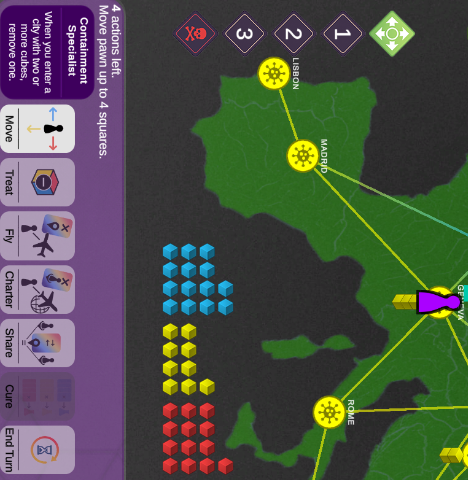

- **`Fly` selected** — expands the player’s cards that can be clicked to choose a destination that matches a card. Actions that **depend on cards** (`Fly`, `Charter`, `Share`, `Cure`) all auto-expand cards like shown in the figures below. When the fly action is selected, the player can cancel the action to collapse the cards and see the available actions again or can click one of the cards to select an intended destination. Once a card is selected. the confirmation button needs to be clicked to complete the action that discards that card and moves the pawn to the city by spending one action.
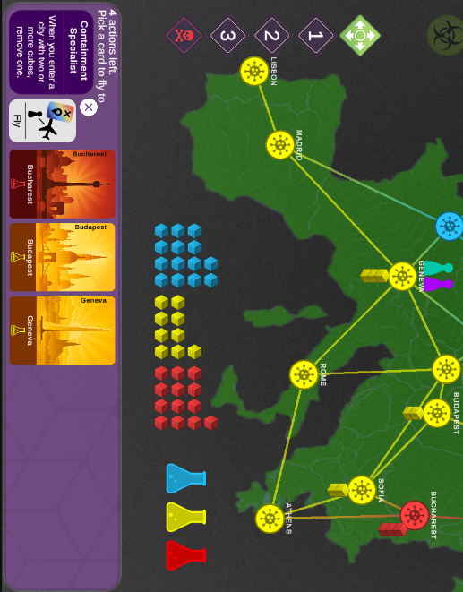 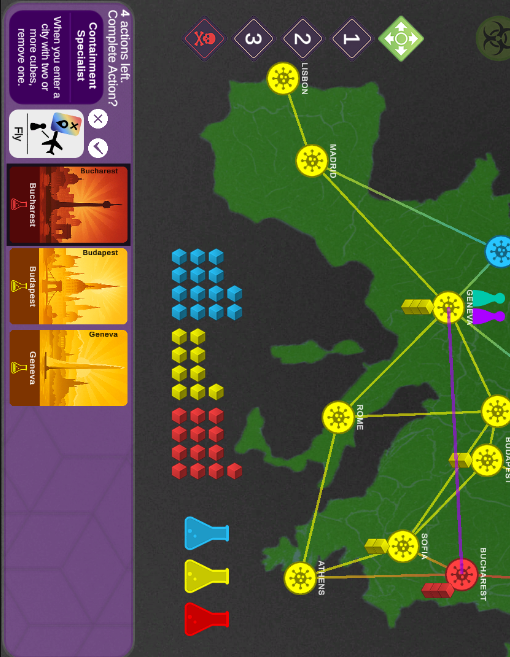 

- **`Charter`** — uses the **current city’s** card and spawns a pawn similarly to `Move` that can be dragged to travel anywhere on the board.
- **`Share`** — expands and selects players’ relevant cards when sharing is possible. It can also be confirmed or cancelled.
- **`Treat`** — removes cubes from the current city. When the action is selected cubes can be clicked to spend an action to cure. If a cure is found it removes all cubes from that color from the city with one action.
- **`Cure`** — available only when requirements are satisfied (i.e., enough same-color cards and at Geneva).
- **`End Turn`** — immediately ends the turn.

---

## 4) Shared Board Elements

### 4.1 Trackers (top of board)
- **Outbreaks**
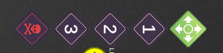
- **Infection Rate**  
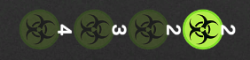
- **Cure Vials** (completed cures)  
  

### 4.2 Decks and Discard Piles
- **Player Deck** (top) — shows remaining card count; discard pile beneath.
- **Infection Deck** (bottom) — shows remaining card count; discard pile beneath.
- **Infection discard** can be **tapped** (see figure on the right) to review which cities are in the discard. This is strategic because those cards are reshuffled back to the top whenever an **Epidemic** happens.  
  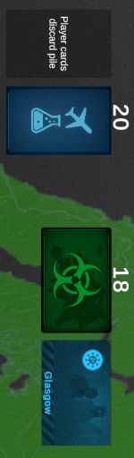 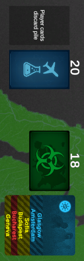

### 4.3 Turn / Phase Banner
A status banner indicates whose turn it is **or** which phase is in progress (player actions, draw player cards, draw infection cards, epidemic).  

### 4.4 Reserve Cubes
Global supply for each disease color. The reserve is reduced as cities gain cubes; certain actions return cubes to the reserve.  
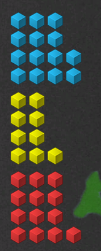

### 4.5 Cities & Connections (Map)
- Cities are connected by travel routes; cubes on cities represent infection levels.
- Pawns show player positions.  
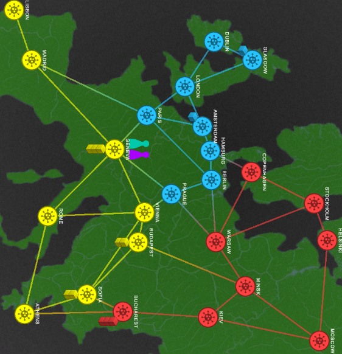

---

## 5) Game Events
- After every turn, when players are done with their actions. Before passing to the next player there are 2 additional stages (drawing player cards and drawing infection cards).
### 5.1 Drawing Player Cards
Players draw two cards every turn. So that each player is aware of the card drawn, we designed an animation that goes from the player deck to the center of the board while magnifying the card and then to the correspoding player's hand. Player's can draw Epidemic cards which trigger and Epidemic.
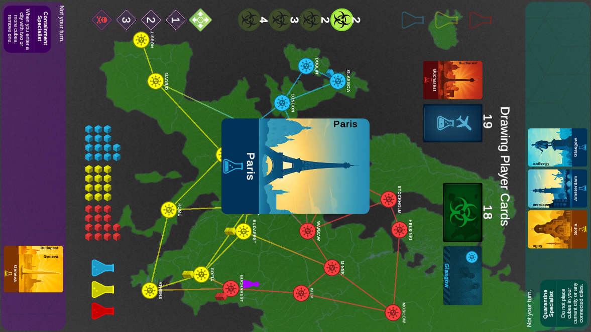

### 5.2 Drawing an Epidemic
- Epidemics have three stages. 
1 - First they increase the infection rate marker (this will make players draw infection cards according to the number each turn).
2 - They infect a city using a card from the bottom of the infection deck with three cubes.
3 - The cards in the infection discard pile get shuffled into the top of the deck. 

This is the design of the epidemic card. It animates to the center of the board similarly to the player cards but animates each of the steps one by one with corresponding animations before minimizing to the player discard pile.
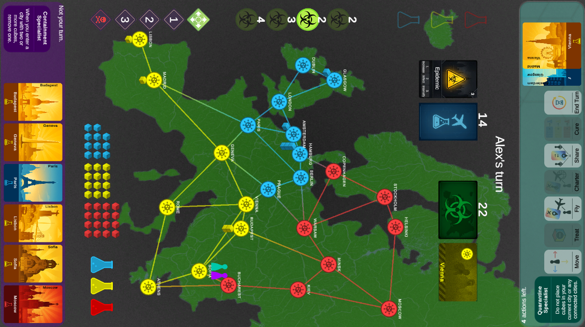
In this example we can see that the Epidemic is already in the discard pile and it has (1) progressed the infection rate marker, (2) infected Hamburg with 3 cubes, and (3) shuffled the Infection cards to the top and drawn the 2 new ones.

### 5.3 Drawing Infection Cards
This stage happens after the players draw two player cards. According to the number currently displayed in the infection rate marker, infection cards are drawn and one extra cube of the corresponding color is transferred from the cube supply to the current city. This is done through the use of animations that can sometimes also trigger an outbreak (when trying to infect a city with the max number of cubes, 3). In the case of outbreaks, cubes are added from the cube supply to infect nearby cities that could in turn result in chain outbreaks. This is all animated so that users are aware of the game events. 

## 6) Win & Loss Conditions

| Condition | How it’s Shown / Triggered |
|---|---|
| **Win** | All **cure vials** are moved to the **completed** marker. |
| **Loss — Outbreaks** | **Outbreak counter** reaches **4**. |
| **Loss — Cubes** | A city would gain a cube but the **reserve** for that color is empty. |
| **Loss — Player Deck** | A player must draw from the **player deck** but it’s empty. |

---

## 7) Design Considerations
- **Multitouch table first:** mirrored player areas on left and right for comfortable reach and orientation.
- **Iconic actions:** action buttons use **intuitive pictograms** so players can infer function at a glance.
- **State via opacity:** enabled actions are bright; disabled actions are dimmed.
- **Strategic transparency:** deck counts are visible; infection discard is reviewable to support planning around epidemics.
- **Clear Animations:** all events and actions are accompanied by intuitive animations that support grounding players to the current state of the game. This is especially important when Artificial Intelligence is playing so that players are aware of what was played. All touches and clicks on the board also have a noticeable animation effect to make them more visible.