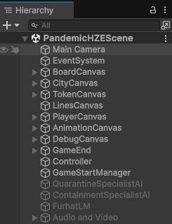
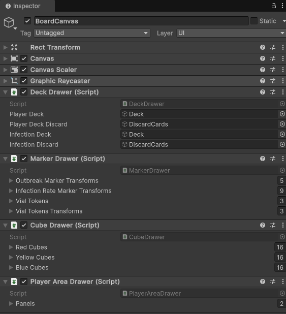
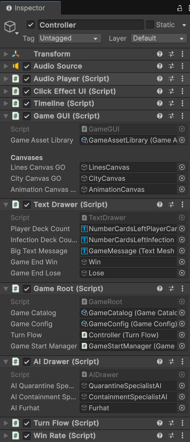
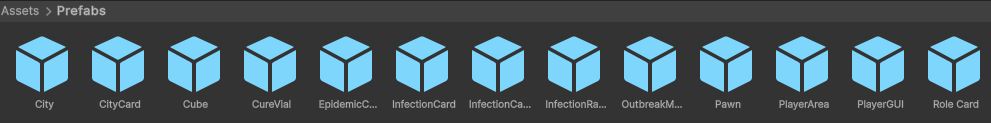
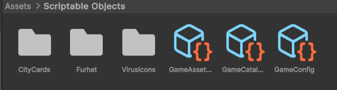
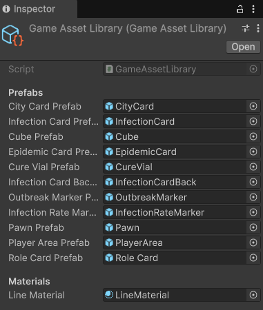
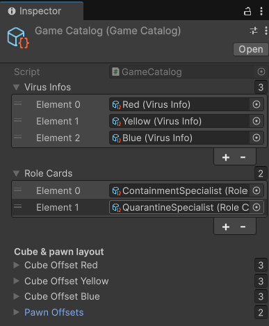
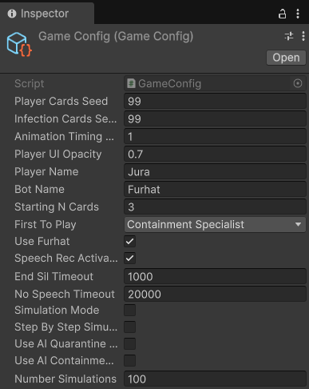

# PandemicAI — Unity Game Objects and Main Game Classes

> This document provides an overview of how the project is structured in Unity, highlighting the key classes responsible for game logic, UI handling, and logging. It includes annotated screenshots of the Unity Editor to guide the reader through the organization of the project's main and only scene. We used Unity version 6000.0.371f for development. We used both Windows and MacOS devices for development but recommend deploying the project as a Windows project if multitouch support is required.

---

## Contents
- [0) Return to Main Document](../pandemic_multitouch_doc.md)
- [1) Scene Layout at a Glance](#1-scene-layout-at-a-glance)
- [2) Asset & Prefab Catalog](#2-asset--prefab-catalog)
- [3) Game State Machine & Turn Flow](#3-game-state-machine--turn-flow)
- [4) Timeline Runtime & Logging](#4-timeline-runtime--logging)
- [5) Player Actions](#5-player-actions-and-event-examples)
---

## 1) Scene Layout at a Glance
**Unity Hierarchy (scene overview):**  

### 1.1 Camera
**Main Camera** — Orthographic camera providing the primary fixed view of the multitouch table.

### 1.2 Event System
**Event System** — Required by unity. It acts as the central manager for detecting and dispatching user input (like clicks and taps) to the correct UI elements.  

### 1.2 Core Canvases
These canvases are layered from bottom to top to control the rendering order, determining which elements appear above others. The BoardCanvas is at the lowest layer, with additional canvases stacked above it accordingly.
**BoardCanvas** — World-space canvas that anchors background art, discard piles, trackers, and debug text used by GameGUI to render the shared board. It also contains the Deck Drawer, Marker Drawer, Cube Drawer and Player Area Drawer scripts that are responsible for interacting with the Game Objects programmatically.   
**Figure — BoardCanvas inspector:**  

**CityCanvas** — Contains every clickable city GameObject and their City scripts, exposing cube and pawn anchor transforms. 
**TokenCanvas** — Layer reserved for movable UI tokens instantiated during play (cubes, pawns, markers). 
**LinesCanvas** — Dedicated overlay for permanent inter-city connection lines drawn once at startup.  
**PlayerCanvas** — Mirrors the two player GUIs.  
**AnimationCanvas** — Overlay used by timeline events to animate cards, cubes, and pawns before destroying temporary clones.
**DebugCanvas** — Only used during development. It contains several useful debugging features such as a quit button, and visualization of the game and AIs internal states.

### 1.3 Controller Hub
**Controller GameObject** — Centralizes behaviours through different scripts: (1) an AudioSource plus AudioPlayer; (2) a click effect script that creates an animation every time a player or AI clicks anywhere in the interface; (3) Timeline, the main orchestrator class in the game, to be described in detail bellow. (4) the GameGUI which orchestrates interaction with the Board, city and animation Canvases; (5) Game Root, responsible for the main flow of the game and all game models; (6) AIDrawer contains references to the AI gameobjects that can be either activated or deactivated; (7) Turn flow, used in the Game Root controller and keeps track of the main state machine of the game; (8) and finally a WinRate script that allows simulation of X ammount of games by different AIs to assess the winRate. 
**Figure — Controller inspector:**  

### 1.4 Game Start Manager
This can either contain a login screen for debug where we can setup options such as which AIs we are using and in which conditions overriding the game config settings in 2) or it allows the usage of a json file that loads the settings when running experiments.

### 1.5 AIs
3 different AIs can be enabled depending on the setting. QuarantineSpecialistAI and ContainmentSpecialistAI are game objects that contain the scripts described in the Game AI documentation. FurhatLM contains all classes related to Furhat, as shown in the Furhat documentation.

### 1.6 Audio and Video
This gameobject contains all functionality to log video (both the game interface and a robot's camera perspective capturing the participant) and audio from each interaction. 

---

## 2) Asset & Prefab Catalog
**Prefabs** — Card views, player pads, pawns, cubes, markers, and supporting UI sprites are kept under `Assets/Prefabs`, matching the scene references serialized on GameGUI.  

**ScriptableObjects** — City, event, role, and virus metadata drive card art, ability text, map neighbours, and disease colours for runtime consumption. These are contained in `Assets/Scriptable Objects`, and keep gameplay configuration editable outside of code.

**Game Asset Library (prefab registry):**  

**Game Catalog (virus & role registries):**  

**Game Config (runtime knobs):**  

---

## 3) Game State Machine & Turn Flow

**Enumerations** — `GameState`, and `EpidemicState` track the macro flow (actions, draws, epidemics, outbreaks), and the current epidemic sub-step.

**GameRoot** — `GameRoot.cs` initializes the game by creating a game state object and the turnflow class. This is a state class, it contains the main state object the initialization logic is in turnflow. Random seeds are initialized here. Seeds for player and infection decks are configurable and persist across shuffles.

**TurnFlow** — `TurnFlow.cs` contains all logic for initialization. It resets player decks and deals opening hands, initializes player models and interfaces, resets the timeline and potentially initializes the AIs if present. It is also responsible for orchestrates the main logic of the game. It watches for event overlays, hand-limit enforcement, draw phases, epidemic sequencing, and outbreak resolution, queuing timeline events at each transition and preventing turn endings until asynchronous events finish.

---

## 4) Timeline Runtime & Logging

**Event Model** — All gameplay interactions subclass `TimelineEvent`, splitting deterministic `Do()` logic, optional animated `Act()` delays, and post-processing log notifications. This allows undoing or loading game states by replaying all Do logic up to a move without executing animations or interface updates contained in Act methods. It also allows for AIs to play against themselves without updating the interface, working only with the models of the game.

**Dispatcher** — `Timeline` maintains pending and processed queues, repeatedly dequeuing events, calling `Do()`, broadcasting logs, then yielding for `Act()`’s delay.

**Logging** — `EventLogger` converts events to JSON-like payloads tagged with timestamp, event type, and the active player’s role/name. The default `FileLogger` appends to disk while `NetworkLogger` is stubbed for future streaming sinks (e.g., AI integrations). External listeners can subscribe via `TimelineEvent.Subscribe()`.

**Event Metadata** — Each major event emits structured payloads (e.g., `PDealCard` card IDs, `EDrawInfectionCard` city ID, `EOutbreak` spread targets, `PCureDisease` cured colour, `PShareKnowledge` participants, `EGameOver` reason), ensuring downstream consumers receive the context they need.

**Timestamps & Players** — Logs are timestamped relative to the moment the game starts, with the active player’s role and name embedded when available, supporting timeline reconstruction for real time interactions or offline analysis.

**Event Library** — Engine, player, and GUI event classes live under `Assets/Scripts/events`, covering setup, epidemics, movements, cures, and UI interactions for comprehensive logging hooks.

---

## 5) Player Actions and Event Examples

**Player Model** — Tracks role, actions remaining, hand composition by colour, current city, and role-specific flags (e.g., containment specialist). Movement updates remove/add pawns.

**Player Panel** —  rebuilds card visuals, enforces discard prompts, updates action buttons, and routes to either own-turn handling, waiting states, or event overlays. It basically controls everything about each player GUI.

**Card & Action Events** — Examples of timeline events that handle the heavy lifting once buttons are clicked in the Player Panel class:
- `PDealCard` draws from the player deck, logging epidemics and triggering `EEpidemicInitiate` immediately if the special card appears.
- `PFlyToCity` discards the matching destination card, animates it to the discard, and moves a pawn token between cities.
- `PCharterEvent` discards the card corresponding to the current city and moves the player to the chosen destination with corresponding animations.
- `PMoveEvent` spends actions based on BFS distance, refreshing both origin and destination city displays.
- `PTreatDisease` removes cubes (all if cured), returns them to reserves, and consumes one action.
- `PCureDisease` discards selected cards, sets cure flags, animates vials, and checks for cooperative victory (all cures discovered).
- `PShareKnowledge` transfers the matching city card between co-located players with an animated slide.
- `PEndTurn` changes to the next player, by resetting actions and moving to the draw player cards phase while refreshing both pads and the board.
